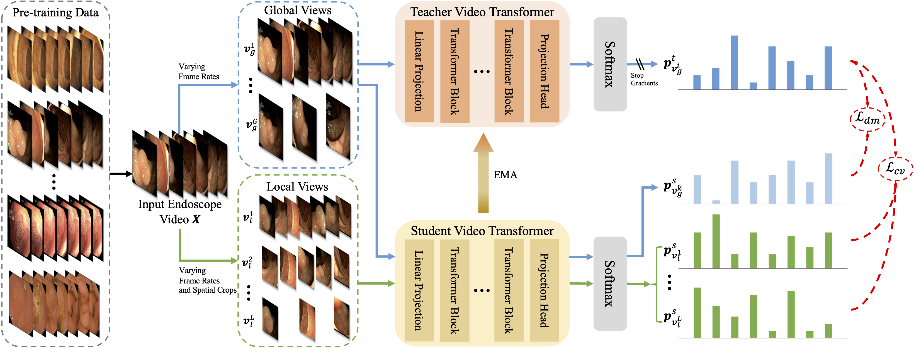

# Foundation Model for Endoscopy Video Analysis

This is the PyTorch[1] implemention of our paper [**Foundation Model for Endoscopy Video Analysis via Large-scale Self-supervised Pre-train**](TBA)
by [Zhao Wang](https://kyfafyd.wang)\*, Chang Liu\*, [Shaoting Zhang](http://www.qingyuan.sjtu.edu.cn/a/Shaoting-Zhang.html)†, and [Qi Dou](http://www.cse.cuhk.edu.hk/~qdou)†.

## Abatract

> Recent foundation models have exhibited remarkable success in various downstream tasks, such as disease diagnosis and report generation. However, a foundation model for endoscopic videos is lacking. In this paper, we propose Endo-FM, a foundation model specifically designed for endoscopic video analysis. First, we build a video transformer as Endo-FM, which captures both local and global long-range dependencies across spatial and temporal dimensions. Second, we pre-train our Endo-FM using global and local views to be robust to spatial-temporal changes and discriminative across different videos. To achieve this, we construct a large-scale endoscopy video dataset by combining all publicly available datasets and a new private one. This dataset consists of over 32K video clips (5M frames), encompassing varying modalities, target organs, and disease types. Our pre-trained Endo-FM achieves promising performance on downstream tasks, surpassing state-of-the-art methods by a significant margin.



## Usage

#### Setup

We suggest using Anaconda to setup environment on Linux, if you have installed anaconda, you can skip this step.

```shell
wget https://repo.anaconda.com/archive/Anaconda3-2020.11-Linux-x86_64.sh && zsh Anaconda3-2020.11-Linux-x86_64.sh
```

Then, we can install packages using provided `environment.yaml`.

```shell
cd Endo-FM
conda env create -f environment.yaml
conda activate endofm
```

#### Datasets
We utilize 6 public and 1 private datasets for pre-training and 3 datasets as the downstream tasks, please refer to [DATASETS.md](./DATASETS.md) for instructions.

#### Pre-trained Weights
You can download our pre-trained Endo-FM from [google drive](https://drive.google.com/file/d/1KouXXV3nh9hc2j3cV2GTI9lDe8FxOzNB/view?usp=sharing) and put it under `checkpoints/foundation_surgical_clips32k`.

#### Pre-training
```shell
cd Endo-FM
wget https://github.com/kahnchana/svt/releases/download/v1.0/kinetics400_vitb_ssl.pth
zsh scripts/train_clips32k.sh
```

#### Downstream Fine-tuning
```shell
# PolypDiag (Classification)
cd Endo-FM
zsh scripts/eval_finetune_polypdet.sh

# CVC (Segmentation)
cd Endo-FM/TransUNet
python train.py

# KUMC (Detection)
cd Endo-FM/STMT
python setup.py build develop
python -m torch.distributed.launch \
    --nproc_per_node=1 \
    tools/train_net.py \
    --master_port=$((RANDOM + 10000)) \
    --config-file configs/STFT/cvcvid_R_50_STFT.yaml \
    OUTPUT_DIR log_dir/kumc_finetune
```

## Citation

If you find this code useful, please cite in your research papers.

```
@inproceedings{
    wang2023foundation,
    title={Foundation Model for Endoscopy Video Analysis via Large-scale Self-supervised Pre-train},
    author={Zhao Wang and Chang Liu and Shaoting Zhang and Qi Dou},
    booktitle={International Conference on Medical Image Computing and Computer-Assisted Intervention},
    pages={},
    year={2023},
    organization={Springer}
}
```

## Questions
For further questions, pls feel free to contact [Zhao Wang](mailto:zwang21@cse.cuhk.edu.hk).

